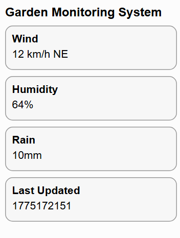

# Garden Monitoring System - HMI

Simple dashboard example for displaying measurements received from the data API endpoint

## Features
- Wind speed and direction
- Humidity
- Rain
- Last updated time

## Project Structure
- `index.html` - dashboard layout
- `static/main.css` - dashboard styling
- `static/main.js` - dashboard data handling

## Preview

## Notes
Designed for a cheap yellow display 240x320 
